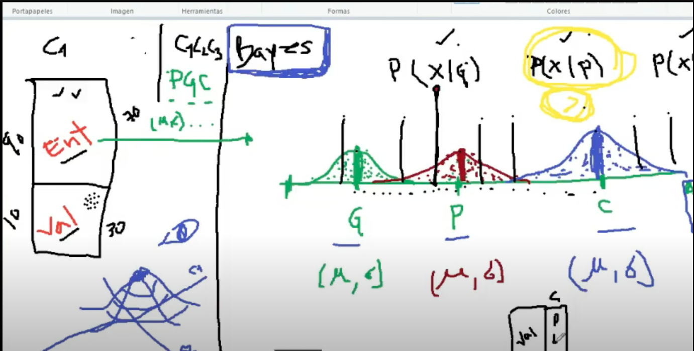

# Naive Bayes

Naive Bayes es un algoritmo de clasificación basado en el teorema de Bayes. Es un algoritmo simple pero muy efectivo para la clasificación de texto. Es un algoritmo de clasificación probabilístico que se basa en el teorema de Bayes. El teorema de Bayes es una ecuación que describe la relación de probabilidades condicionales de cantidades estadísticas. En el contexto de la clasificación, el teorema de Bayes se utiliza para predecir la probabilidad de que un punto de datos dado pertenezca a una clase en particular.

El teorema de Bayes se define como:

\[
P(A|B) = \frac{P(B|A)P(A)}{P(B)}
\]

Donde:

- \(P(A|B)\) es la probabilidad de que la hipótesis A sea verdadera dada la evidencia B.
- \(P(B|A)\) es la probabilidad de que la evidencia B sea verdadera dada la hipótesis A.
- \(P(A)\) es la probabilidad de que la hipótesis A sea verdadera.
- \(P(B)\) es la probabilidad de que la evidencia B sea verdadera.

El clasificador Naive Bayes asume que la presencia de una característica particular en una clase no está relacionada con la presencia de cualquier otra característica. Incluso si estas características dependen entre sí o de la existencia de otras características, todas estas propiedades contribuyen de manera independiente a la probabilidad de que una observación pertenezca a una clase en particular.

    
    
Figura 1. Clasificador Naive Bayes

