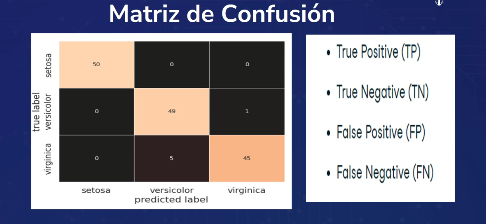
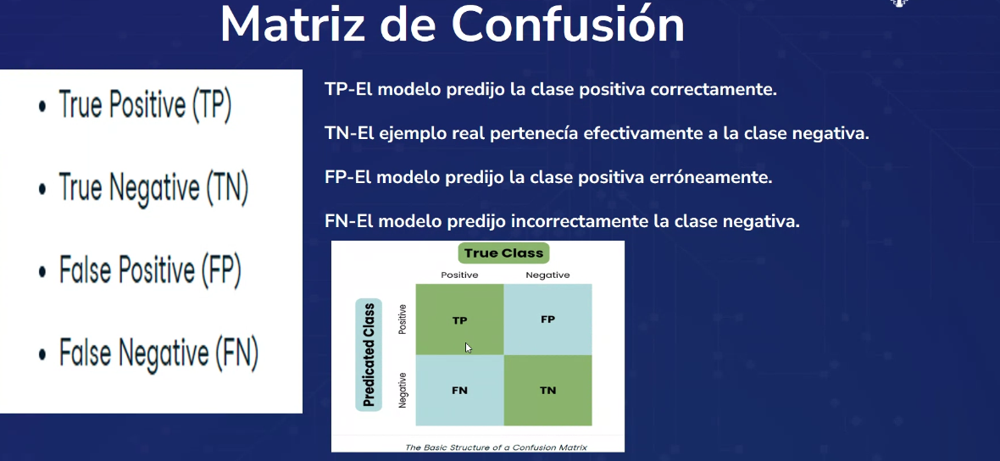
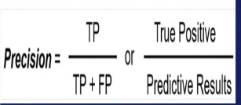
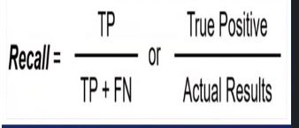
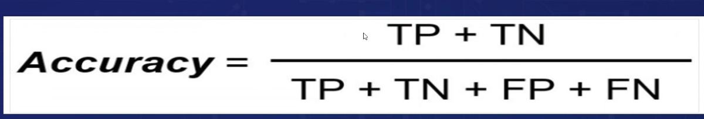
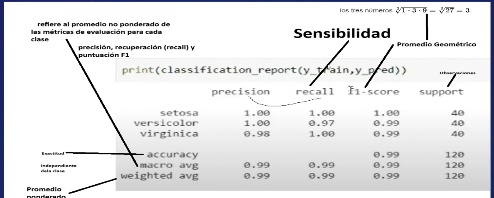
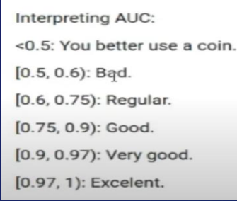

# Matriz de confusión

La matriz de confusión es una herramienta que permite la visualización del desempeño de un algoritmo de clasificación. Cada fila de la matriz representa el número de instancias en una clase predicha, mientras que cada columna representa el número de instancias en una clase real (o viceversa). La diagonal principal de la matriz representa las instancias que han sido clasificadas correctamente, mientras que los elementos fuera de la diagonal principal representan las instancias que han sido clasificadas incorrectamente.

    

    

Lo más importante de la matriz de confusión es la diagonal principal, ya que representa las instancias que han sido clasificadas correctamente. A partir de la matriz de confusión, se pueden calcular diferentes métricas de evaluación del desempeño de un algoritmo de clasificación, como la precisión, la sensibilidad, la especificidad y la tasa de error.

## Precisión (Precision)

La precisión es una métrica que mide la proporción de instancias clasificadas correctamente por un algoritmo de clasificación. Se calcula como la proporción de instancias clasificadas correctamente sobre el total de instancias clasificadas. **(Se revisa la clase positiva)**

El valor de la precisión varía entre 0 y 1, donde 1 indica que todas las instancias han sido clasificadas correctamente y 0 indica que ninguna instancia ha sido clasificada correctamente.

    

## Sensibilidad 

La sensibilidad es una métrica que mide la proporción de instancias positivas que han sido clasificadas correctamente por un algoritmo de clasificación. Se calcula como la proporción de instancias positivas clasificadas correctamente sobre el total de instancias positivas. **(Se revisa la clase positiva)**

El valor de la sensibilidad varía entre 0 y 1, donde 1 indica que todas las instancias positivas han sido clasificadas correctamente y 0 indica que ninguna instancia positiva ha sido clasificada correctamente.

    

## Especificidad (Specificity)

La especificidad es una métrica que mide la proporción de instancias negativas que han sido clasificadas correctamente por un algoritmo de clasificación. Se calcula como la proporción de instancias negativas clasificadas correctamente sobre el total de instancias negativas. **(Se revisa la clase negativa)**

El valor de la especificidad varía entre 0 y 1, donde 1 indica que todas las instancias negativas han sido clasificadas correctamente y 0 indica que ninguna instancia negativa ha sido clasificada correctamente.

    

## Exactitud (Accuracy)

La exactitud es una métrica que mide la proporción de instancias clasificadas correctamente por un algoritmo de clasificación. Se calcula como la proporción de instancias clasificadas correctamente sobre el total de instancias. **(Se revisa la clase positiva y la clase negativa)**

    

## F-Score

El F-Score es una métrica que combina la precisión y la sensibilidad en una sola métrica. Se calcula como la media armónica de la precisión y la sensibilidad. **(Se revisa la clase positiva)**

    

## Reporte de clasificación

El reporte de clasificación es una tabla que muestra diferentes métricas de evaluación del desempeño de un algoritmo de clasificación. Las métricas que se muestran en el reporte de clasificación son la precisión, la sensibilidad, la especificidad, el F-Score y el soporte.

    

## Curva ROC

La curva ROC es una gráfica que muestra la relación entre la sensibilidad y la especificidad de un algoritmo de clasificación. La curva ROC es una herramienta que permite visualizar el desempeño de un algoritmo de clasificación en diferentes umbrales de decisión.

    

## Área bajo la curva ROC (AUC-ROC)

El área bajo la curva ROC (AUC-ROC) es una métrica que mide la capacidad de discriminación de un algoritmo de clasificación. El valor del AUC-ROC varía entre 0 y 1, donde 1 indica que el algoritmo de clasificación es capaz de discriminar perfectamente entre las clases y 0 indica que el algoritmo de clasificación no es capaz de discriminar entre las clases.

    

#### Interpretación del AUC-ROC

    

