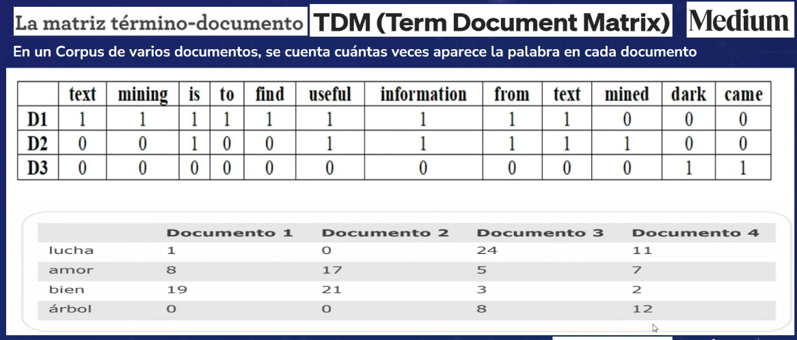

# Procesamiento de Lenguaje Natural (NLP)

El Procesamiento de Lenguaje Natural (NLP) es una rama de la inteligencia artificial que se ocupa de la interacción entre las computadoras y los seres humanos a través del lenguaje natural. El objetivo de NLP es leer, comprender y hacer sentido de los lenguajes humanos en una manera valiosa.

## Tareas de NLP

Algunas de las tareas más comunes en NLP son:

- **Tokenización**: Dividir un texto en palabras, frases o en otros elementos significativos.
- **Lematización**: Convertir una palabra a su forma base.
- **POS Tagging**: Asignar una etiqueta gramatical a cada palabra en un texto.
- **NER**: Identificar y clasificar entidades mencionadas en un texto.
- **Análisis de Sentimientos**: Determinar la actitud de un autor hacia un tema o la polaridad de un texto.
- **Traducción Automática**: Traducir un texto de un idioma a otro.
- **Generación de Texto**: Crear texto automáticamente.
- **Resumen de Texto**: Crear un resumen de un texto.
- **Reconocimiento de Voz**: Convertir el habla en texto.
- **Diálogo**: Interacción entre un humano y una máquina a través del lenguaje natural.
- **Preguntas y Respuestas**: Responder preguntas en lenguaje natural.
- **Extracción de Información**: Extraer información estructurada a partir de texto no estructurado.
- **Clasificación de Texto**: Clasificar un texto en una o más categorías.

## Bibliotecas de NLP

Algunas de las bibliotecas más populares para NLP son:

- **NLTK**: Natural Language Toolkit para Python, ayuda a trabajar con texto en Python.
- **spaCy**: Biblioteca de procesamiento de lenguaje natural en Python. aporta una API simple y eficiente.
- **TextBlob**: Biblioteca de procesamiento de lenguaje natural en Python, construida sobre NLTK y Pattern. Proporciona una API sencilla para tareas comunes de NLP.
- **Gensim**: Biblioteca de modelado de temas y procesamiento de texto en Python. Proporciona una implementación eficiente de algoritmos de modelado de temas.
- **Stanford NLP**: Conjunto de herramientas de procesamiento de lenguaje natural desarrolladas por el Grupo de Procesamiento de Lenguaje Natural de Stanford. Proporciona una API simple para muchas tareas de NLP.
- **OpenNLP**: Herramientas de procesamiento de lenguaje natural de Apache. Proporciona una API simple para muchas tareas de NLP.
- **CoreNLP**: Biblioteca de procesamiento de lenguaje natural de Stanford. Proporciona una API simple para muchas tareas de NLP.
- **FastText**: Biblioteca de Facebook para aprendizaje de representaciones de palabras y clasificación de texto.
- **BERT**: Modelo de lenguaje bidireccional de Google para el procesamiento de lenguaje natural.

### Brown Corpus: Corpus of American English

- Este corpus es un corpus de texto en inglés que contiene 500 muestras de texto de una amplia variedad de géneros, incluyendo noticias, editoriales, novelas, etc. Es uno de los primeros corpus de texto en inglés que se crearon y es un recurso muy valioso para la investigación en lingüística computacional.

### Lenguaje

El lenguaje se puede dividir en dos categorías principales:

- **Gramática Prescriptiva**: Reglas que se deben seguir para hablar y escribir correctamente.
- **Gramática Descriptiva**: Reglas que describen cómo se habla y se escribe un idioma en la práctica.

### Sustitución, Eliminación y Adición de Palabras

- **Sustitución de Palabras**: Reemplazar una palabra por otra.
- **Eliminación de Palabras**: Eliminar una palabra.
- **Adición de Palabras**: Agregar una palabra.

Por ejemplo en el siguiente texto:

```
El gato está durmiendo en la alfombra.
```

Podemos realizar las siguientes operaciones:

- **Sustitución**: El perro está durmiendo en la alfombra.
- **Eliminación**: El gato está durmiendo en la.
- **Adición**: El gato está durmiendo en la alfombra azul.
- **Sustitución, Eliminación y Adición**: El perro está durmiendo en la alfombra azul.


### N-gramas

n-gram = secuencia de n elementos de una secuencia dada de texto o habla. Un n-grama de texto es una subsecuencia de n elementos de una secuencia de texto. Un n-grama de palabras es una subsecuencia de n palabras de una secuencia de texto.

Ejemplo:

- Unigram: "El", "gato", "está", "durmiendo", "en", "la", "alfombra". -> 7 unigramas.
- Bigram: "El gato", "gato está", "está durmiendo", "durmiendo en", "en la", "la alfombra". -> 6 bigramas.

### Vectores y Word Embeddings

- **Word Embeddings**: Representación vectorial de palabras.
- **Word2Vec**: Modelo de aprendizaje no supervisado desarrollado por Google que aprende representaciones vectoriales de palabras.
- **GloVe**: Modelo de aprendizaje no supervisado desarrollado por Stanford que aprende representaciones vectoriales de palabras.
- **FastText**: Modelo de aprendizaje no supervisado desarrollado por Facebook que aprende representaciones vectoriales de palabras.

A la final cuando se entrena el modelo, se obtiene una matriz de vectores de palabras, donde cada fila es un vector de palabras que representa una palabra en el vocabulario.

Por ejemplo al final la palabra "gato" puede ser representada por un vector de 100 dimensiones, o sea un vector de 100 elementos. [0.1, 0.2, 0.3, ..., 0.9, 1.0].

Las dimensiones de los vectores de palabras son hiperparámetros que se pueden ajustar durante el entrenamiento del modelo. Y cada dimensión del vector de palabras representa una característica de la palabra. Por ejemplo 100 dimensiones pueden representar 100 características de la palabra.

Para entrenar un Word Embedding se necesita:

1. Un Corpus: Conjunto de textos.
2. Método de Embedding: Word2Vec, GloVe, FastText, TF-IDF, etc.

#### Distancia Cosine

La distancia del coseno entre dos vectores es una medida de similitud entre dos vectores de espacio vectorial que tiene una dirección y una magnitud. Se mide por el coseno del ángulo entre dos vectores y determina si dos vectores son similares o no.

Cuando la distancia de coseno es 1, los vectores son idénticos. Cuando la distancia de coseno es 0, los vectores son ortogonales. Cuando la distancia de coseno es -1, los vectores son opuestos.

## TDM Term Document Matrix

- **TDM**: Matriz que representa la frecuencia de términos en documentos.

Por ejemplo:

```
| Términos | Doc1 | Doc2 | Doc3 |
|----------|------|------|------|
| T1       | 1    | 0    | 1    |
| T2       | 0    | 1    | 0    |
| T3       | 1    | 1    | 0    |
```

<div align="center">
  
</div>

## TF-IDF Term Frequency-Inverse Document Frequency

- **TF-IDF**: Medida estadística que evalúa la importancia de una palabra en un documento en relación con una colección de documentos.

Por ejemplo:

```
| Términos | Doc1 | Doc2 | Doc3 |
|----------|------|------|------|
| T1       | 0.5  | 0    | 0.5  |
| T2       | 0    | 0.5  | 0    |
| T3       | 0.5  | 0.5  | 0    |
```
