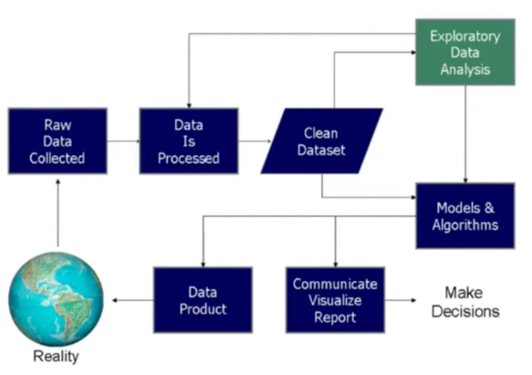

# Inteligencia Artificial

## Índice
- [Inteligencia Artificial](#inteligencia-artificial)
  - [Machine Learning](#machine-learning)
    - [Consejos para Proyectos de Machine Learning](#consejos-para-proyectos-de-machine-learning)
  - [Análisis de Datos](#análisis-de-datos)
    - [Tipos de Análisis](#tipos-de-análisis)

## Machine Learning

> [!TIP]
> Los datos son el nuevo petróleo. La inteligencia artificial es la nueva electricidad. (Andrew Ng)

Los datos representan el punto de partida para el desarrollo de modelos de machine learning. Los modelos de machine learning son algoritmos que aprenden a partir de los datos y son capaces de hacer predicciones o tomar decisiones basadas en ellos. Para las empresas es importante poder aprovechar los datos para mejorar sus procesos y tomar decisiones más informadas. Por ejemplo, para predecir la demanda de un producto, detectar fraudes, o personalizar la experiencia del cliente.

### Consejos para Proyectos de Machine Learning

Para poder triunfar en proyectos de machine learning: (Daoud Clarke, 2021)

1. **Conocer el negocio**. Es importante entender el negocio para poder identificar las variables que más impactan en el resultado. Debes conocer cual es la necesidad del negocio y cómo se puede resolver con machine learning.
2. **Conocer los alcances del ML**. No todo se puede resolver con machine learning. Es importante conocer los alcances y limitaciones de esta tecnología.
3. **Conocer los datos**. Los datos son la materia prima del machine learning. Es importante conocer los datos con los que se cuenta, su calidad y disponibilidad.
4. **Un plan para el cambio**. Implementar un modelo de machine learning implica un cambio en la organización. Es importante tener un plan para gestionar este cambio.
5. **Evitar la optimización prematura**. No es recomendable optimizar un modelo antes de tiempo. Es importante primero tener un modelo que funcione y luego optimizarlo.
6. **Mitigar riesgos**. Es importante identificar los riesgos de un proyecto de machine learning y tener un plan para mitigarlos.
7. **Usar el sentido común**. A veces los modelos de machine learning pueden dar resultados inesperados. Es importante usar el sentido común para validar los resultados.

## Análisis de Datos

La ciencia de datos es el proceso de exploración, limpieza y modelado de datos para descubrir información útil, informar conclusiones y apoyar la toma de decisiones.

### Tipos de Análisis

La analítica de datos tiene 4 tipos de análisis:

1. **Descriptivo**: Describe los datos y su distribución. (Qué está pasando en mi modelo de negocio) (Medidas de tendencia central, medidas de dispersión, gráficos)
2. **Diagnóstico**: Explica por qué ocurrieron ciertos eventos. (Por qué está pasando) (Análisis de correlación, análisis de regresión)
3. **Predictivo**: Predice eventos futuros. (Qué va a pasar)
4. **Prescriptivo**: Sugiere acciones a seguir. (Qué hacer)